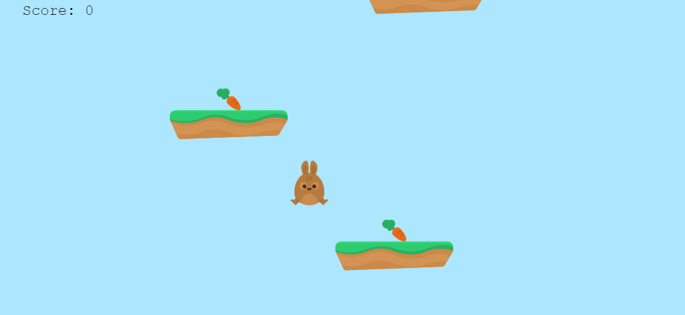

# rabbit-flare

Rabbit flare is an exciting platform game that is based on the concept of an endless game. The character is a bunny that jumps onto platforms as it searches for carrots to feed. As the player controls the bunny, and feeds it on the carrots, he/she garners more points on the score. If in any case the bunny jumps off and fails to land on any platform, it falls to its doom, and that's Game Over!

## live demo

[click to play](https://leon-mbegera.github.io/rabbit-flare/)

## Play instructions
1. Once the game has loaded, a title scene appears with various buttons. Hit the play button.
2. Give your preferred player name on the form that appears and hit on the button start game. This will   commence the game. Get ready!
3. Make use of the up key to perform an extra jump when it the air, left and right keys to move the rabbit left or right so that it land on a platform.
4. Control the rabbit to collide with carrots so that you can earn points on your score.
5. If your steer the rabbit far off the game scene, or below the bottom-most platform, the game will be over.
6. The game over scene will be displayed, and in about 2 secs, the leaderboard will come up.
7. Hit on Restart button if you want to replay.

## Built with
- JavaScript
- Phaser

## To get started
- Clone this repository onto your local machine and cd into its directory in your code editor.
- ` git clone https://github.com/Leon-Mbegera/rabbit-flare.git`
- ` cd rabbit-flare`

## Using webpack
- Install packages and node dependencies needed:
- ` npm install`

- run the below command for webpack to always track changes made in the game scenes and its dependent modules.
- `$ npm run start`
- Follow the link in the terminal after running the command just above to view and play the game live on your browser

## Testing

- run `npm run test` on the terminal.

## Author

👤 **Leon**

- GitHub: [github](https://github.com/Leon-Mbegera)
- LinkedIn: [LinkedIn](https://www.linkedin.com/in/leon-mbegera)

## 🤝 Contributing

Contributions, issues and feature requests are welcome!

Feel free to check the [issues page](https://github.com/Leon-Mbegera/rabbit-flare/issues/).

## Show your support

Give a ⭐️ if you like this project!

## Acknowledgement

Big thanks to Kenny's public dormain library of art assets ⭐️
